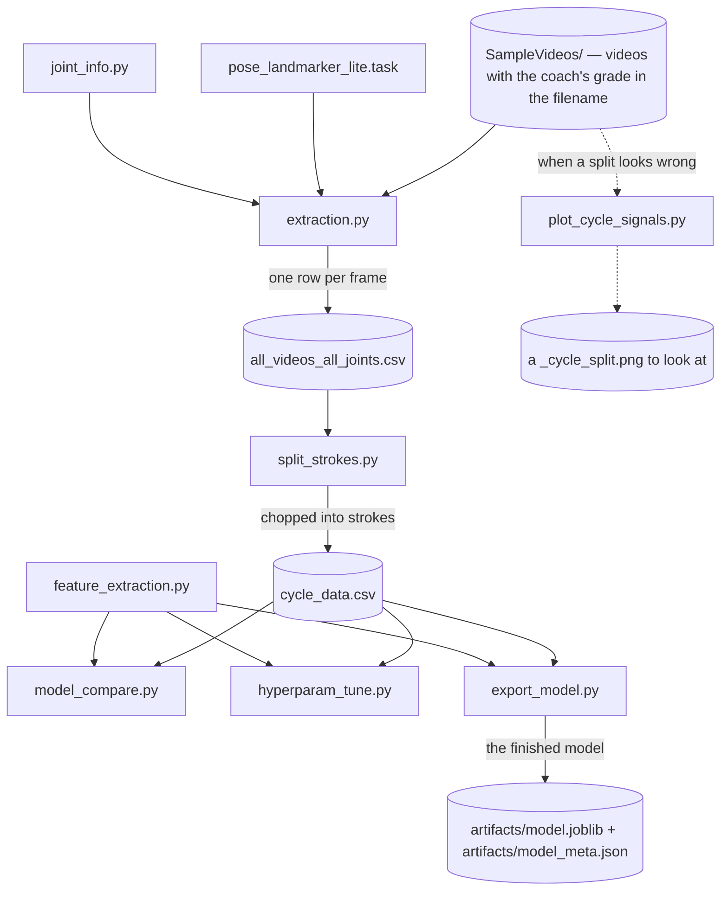
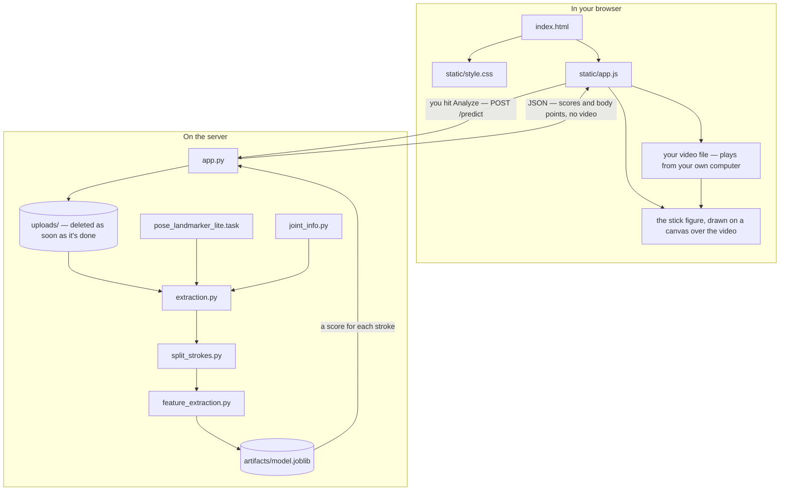
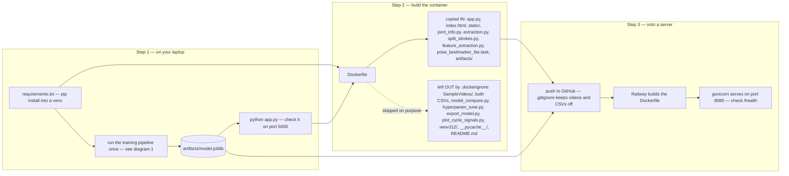

# StrokeScore — diagrams

Three pictures of how this project fits together: how I trained the model, what
happens when someone uploads a video, and how to get the whole thing onto a
server. Between them, every file in the project shows up at least once — there's a
table at the bottom saying which diagram each file is in.

(These are Mermaid diagrams. GitHub draws them as real boxes and arrows. If you're
reading this in a plain text editor you'll just see the code that describes them.)

---

## 1. The training pipeline

This is the part I only run on my own computer, to produce the model file. The app
never does any of this.

**Reading it:** videos go in at the top, a saved model comes out at the bottom.
`extraction.py` is the slow step — it looks at every other frame of every video and
finds the body. `split_strokes.py` cuts that into individual strokes.
`feature_extraction.py` doesn't get its own step in the chain because it's a
toolbox, not a script you run: it's the thing that turns one stroke into the six
numbers, and all three of the bottom scripts call it.

`model_compare.py` and `hyperparam_tune.py` are for deciding *which* model to use —
they don't produce anything the app needs. Only `export_model.py` writes the file
that actually gets deployed. The dotted branch on the left is the debugging tool
for when a video comes out with a weird number of strokes.

Two notes. `joint_info.py` is used by basically every box here, not just
`extraction.py` — it's the map of which column holds which body part, and drawing
all those arrows would've made a mess. And both CSVs are in `.gitignore`: they're
big, and you can always rebuild them by re-running the first two steps.

---

## 2. What happens when someone uses the app

**Reading it:** the middle three steps on the server side are the exact same files
as steps 1–3 of the training diagram. That's on purpose — if the app measured
strokes differently than training did, the scores would be nonsense.

The thing worth noticing is the arrow coming back. It carries **only numbers**, not
video. Your browser already has your video file, so it just plays that copy, and
the stick figure gets drawn on a transparent canvas sitting exactly on top of it.
That's why the response is about 200 KB instead of tens of megabytes, and it's why
`uploads/` empties itself out — the server has no reason to keep your video once
it's counted the strokes.

`static/app.js` is doing the most work on this diagram: it uploads the file, draws
the figure, keeps it lined up with the video as it plays, runs the tabs, and builds
the chart.

---

## 3. Deploying it

**Reading it:** the useful part is the two boxes in step 2. The container only
needs to *run* the model, never to train it, so all the training stuff gets left
out — that's what `.dockerignore` is for, and it's why the image isn't enormous.
Docker is basically a box containing a specific Python version plus the exact
libraries from `requirements.txt`, so it behaves the same on a server as it does on
my laptop.

**The thing that trips you up:** `artifacts/model.joblib` has to be committed to
GitHub. `.gitignore` deliberately blocks the videos and `cycle_data.csv`, and it'd
be easy to assume the model file is "generated stuff" too — but nothing on the
server can rebuild it, because the training videos aren't up there. If it's
missing, the app crashes the moment it starts with a "Model not found" message.

**The other thing that trips you up:** the `COPY` line in the `Dockerfile` lists
files one by one. If you add a new CSS or JS file and forget to add it there, it
works perfectly on your laptop and is simply missing inside the container.

Also, two different ports: `python app.py` uses 5000 for local testing, and
gunicorn in the container uses 8080. Gunicorn is set to allow 5 minutes per request,
because a long video genuinely takes minutes to analyze and the normal 30-second
limit would cut it off partway.

---

## Which diagram is each file in?

| File | Diagram |
|---|---|
| `SampleVideos/` | 1 |
| `extraction.py` | 1, 2 |
| `split_strokes.py` | 1, 2 |
| `feature_extraction.py` | 1, 2 |
| `joint_info.py` | 1, 2 |
| `pose_landmarker_lite.task` | 1, 2 |
| `all_videos_all_joints.csv` | 1 |
| `cycle_data.csv` | 1, 3 |
| `model_compare.py` | 1, 3 |
| `hyperparam_tune.py` | 1, 3 |
| `export_model.py` | 1, 3 |
| `plot_cycle_signals.py` | 1, 3 |
| `artifacts/model.joblib` | 1, 2, 3 |
| `artifacts/model_meta.json` | 1 |
| `app.py` | 2, 3 |
| `index.html` | 2, 3 |
| `static/app.js` | 2, 3 |
| `static/style.css` | 2, 3 |
| `uploads/` | 2 |
| `requirements.txt` | 3 |
| `Dockerfile` | 3 |
| `.dockerignore` | 3 |
| `.gitignore` | 3 |
| `.venv312/` | 3 |
| `__pycache__/` | 3 |
| `README.md` | 3 |

The only files not on a diagram are `details_technical.md` and this file, which are
just writing about the project rather than part of it.
